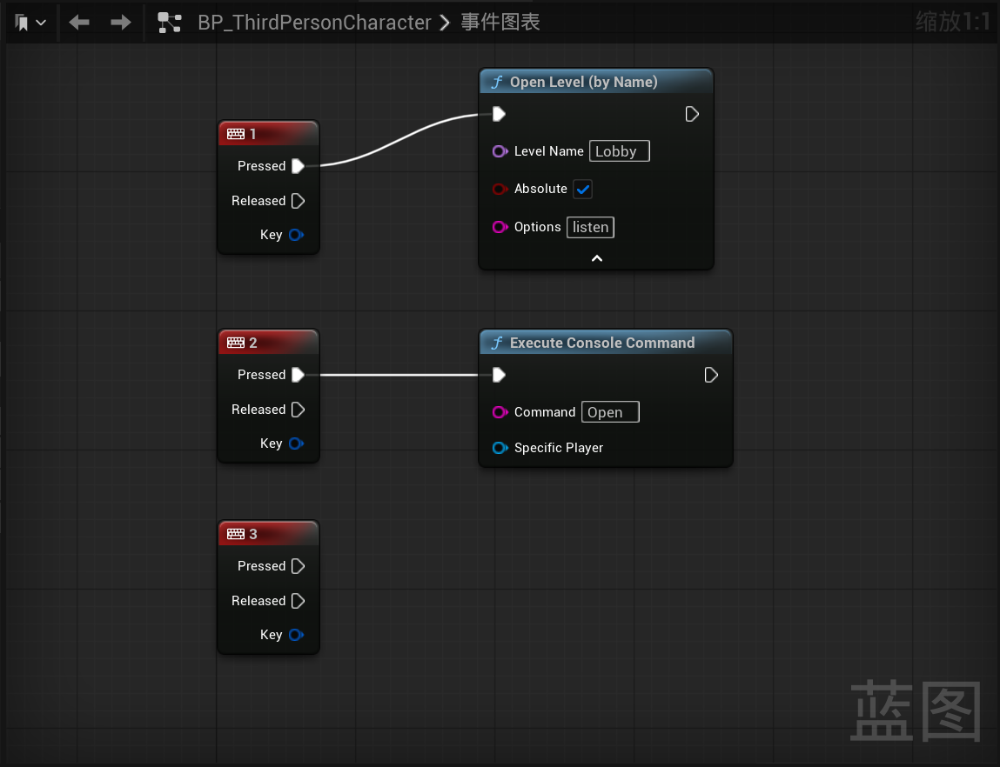

# 测试多人游戏

## 在虚幻引擎中进行多人游戏测试

在虚幻引擎内部运行游戏之前调整运行按钮旁边的展开菜单中的“多玩家选项”中的相关设置可以实现在引擎之中测试多人游戏，此时运行你会发现开启了多个游戏窗口，多个角色之间相互可以看到对方

## 局域网联机测试

建一个新场景“Lobby”用来作为联机的大厅，我们希望在运行游戏之后按“1”让机器既作为客户端又作为服务端运行，然后让另一台机器加入按“2”加入这个会话，并且相互能够看到彼此的运动信息等。为此，我们编辑`BP_ThirdPersionCharacter`蓝图（`Open`之后要补上自己的主机IP地址）：

然后和朋友连接同一个WIFI，之后一个人先按“1”加入作为主机，另一个人按“2”加入，然后就可以看到彼此了

> [!Note]
> 在打包游戏之前记得把第三人称模板自带的默认场景和自己创建的`Lobby`场景都加入到“项目设置”中的“打包版本中要包括的地图列表”中，否则你打包出来的游戏按“1”会发现无法切换到自己创建的`Lobby`场景中
