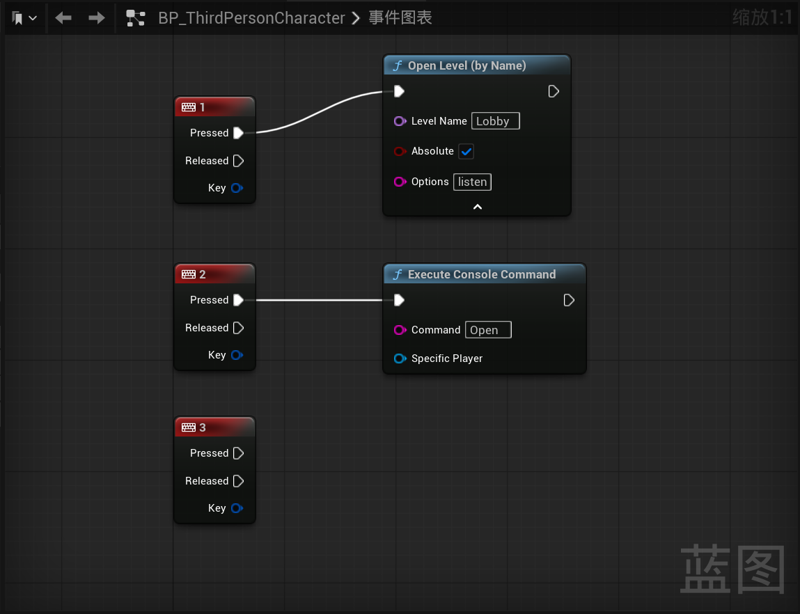
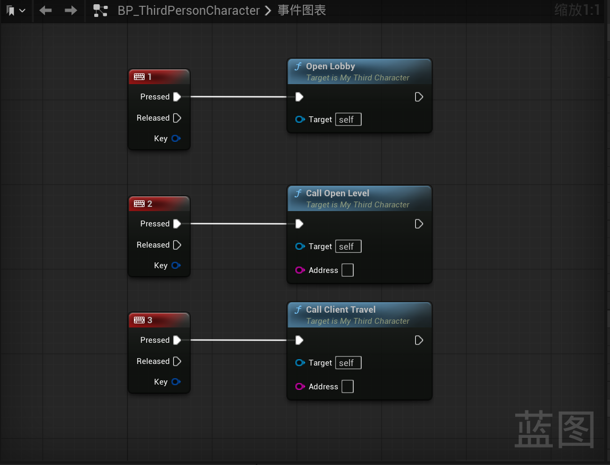

# 测试多人游戏

## 在虚幻引擎中进行多人游戏测试

在虚幻引擎内部运行游戏之前调整运行按钮旁边的展开菜单中的“多玩家选项”中的相关设置可以实现在引擎之中测试多人游戏，此时运行你会发现开启了多个游戏窗口，多个角色之间相互可以看到对方

## 局域网联机测试

### 蓝图实现

建一个新场景“Lobby”用来作为联机的大厅，我们希望在运行游戏之后按“1”让机器既作为客户端又作为服务端运行，然后让另一台机器加入按“2”加入这个会话，并且相互能够看到彼此的运动信息等。为此，我们编辑`BP_ThirdPersionCharacter`蓝图（`Open`之后要补上自己的主机IP地址）：



然后和朋友连接同一个WIFI，之后一个人先按“1”加入作为主机，另一个人按“2”加入，然后就可以看到彼此了

> [!Note]
> 在打包游戏之前记得把第三人称模板自带的默认场景和自己创建的`Lobby`场景都加入到“项目设置”中的“打包版本中要包括的地图列表”中，否则你打包出来的游戏按“1”会发现无法切换到自己创建的`Lobby`场景中

### C++实现

上面的蓝图功能也可以使用代码实现，我们借助`UFUNCTION(BlueprintCallable)`来将我们的方法暴露给蓝图系统：

```cpp
UFUNCTION(BlueprintCallable)
void OpenLobby();

UFUNCTION(BlueprintCallable)
void CallOpenLevel(const FString& Address);

UFUNCTION(BlueprintCallable)
void CallClientTravel(const FString& Address);
```

随后我们实现这些方法，并如法炮制地在蓝图系统中调用：



这里的蓝图和上面纯蓝图实现的版本不同，这里按键“1”、“2”、“3”触发的方法是我们自己用cpp代码实现的

随后我们运行游戏，会发现效果和之前是一样的，尽管我们使用的方法不是蓝图系统自带的而是我们自己编码实现的
